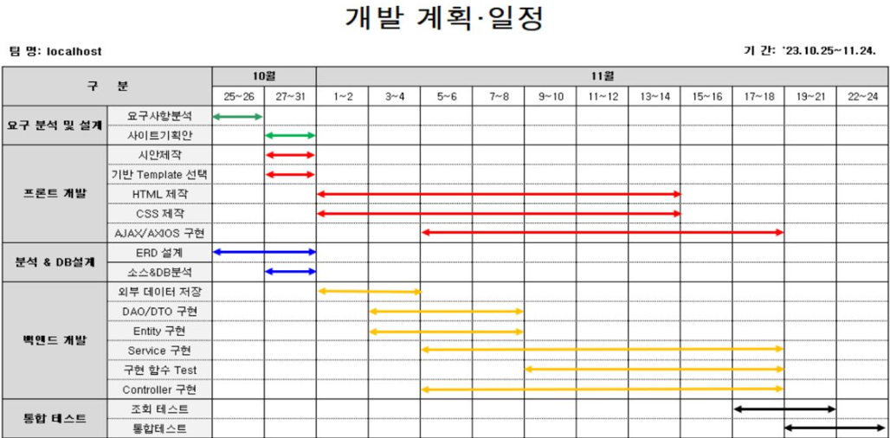

# localhost
공공 데이터를 스크래핑하여 교통사고 위험구역 분석 및 예방체계 구축하는 팀 프로젝트입니다.
 
 
 
## 📌 추진배경
**데이터의 분산**
- 일반 사고는 행정안전부, 결빙은 도로교통공단
- 각 부처의 데이터를 통합해 한 눈에 볼 수 있는 서비스 개발
> 분산된 데이터를 스크래핑, 하나의 데이터베이스에 저장하여 서비스

 

## ⚙️ 개발 환경 및 운영 환경
**Frontend**
- language : HTML, CSS, JAVASCRIPT, JQUERY
- IDE : IntelliJ

**Backend**
- Framework: Spring boot (JPA)
- SDK: 11
- IDE: IntelliJ
- OS: Cent OS 7
- DB: MariaDB
- VCS: SVN
 
 

## :memo: 개발 계획 및 일정

  
  
  
## ✨ 프로젝트 기능
### 교통사고 조회
- KakaoMap API를 사용 지도 위에 마커로 표시
- 목록 페이지에서 사고 목록을 표시
### 상세 조회
- 지도 위에 마커나 왼쪽 목록을 클릭
- 모달 창을 띄워 자세한 정보를 표시
### 검색 기능
- 목록 페이지 검색 상자에 검색어 입력후 검색
- 왼쪽 목록 페이지와 지도 마커로 정보 표시
### 통계 기능
- 저장한 데이터를 가공해 통계로 표시
- 유형과 연도에 따른 사상자 통계를 제공
### 구현 방법
- Chart.js를 사용하여 막대, 선, 도넛, 레이더 그래프 표시

## 프로젝트를 통해 배운점
### 컴포넌트 기반의 웹 구조 설계 능력 향상
- 프론트와 백엔드를 분리하여 작업하면서, 화면 구성 요소를 기능별로 나누고 유지보수하기 쉬운 구조로 설계하는 경험을 쌓았습니다.

### 공공 데이터 수집 및 정제 과정 경험
- 여러 부처에서 제공하는 데이터의 형식이 제각각이라 일관성 있는 데이터로 통합하기 어려웠습니다. 이를 해결하기 위해 스크래핑 후 데이터를 정규화하고, 구조화하는 과정을 직접 설계하며 데이터 처리 능력을 키웠습니다.

### Spring Boot와 JPA를 활용한 백엔드 개발 역량 강화
- RESTful API 설계, JPA를 통한 데이터 접근, 서비스 계층의 분리 등 백엔드 아키텍처 전반을 직접 구현하면서 스프링 프레임워크에 대한 실전 경험을 얻었습니다.

### 지도 API(KakaoMap) 및 시각화 도구(Chart.js) 연동 경험
- 외부 API를 활용하여 지도 위에 교통사고 위치를 마커로 시각화하고, 통계 데이터를 그래프로 표시함으로써 사용자의 직관적인 이해를 돕는 UI를 구현할 수 있었습니다.

### 협업 도구와 일정 관리 능력 향상
- SVN을 통해 버전 관리를 하고, 팀원들과의 일정 조율 및 역할 분담을 통해 협업 능력을 향상시킬 수 있었습니다. 정기적인 회의를 통해 피드백을 반영하고 기능을 개선해 나갔습니다.

